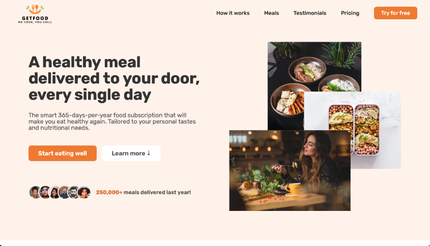

# GetFood - Healthy Meals Delivered

Welcome to the repository for GetFood, a beautifully designed landing page that guides customers through ordering a variety of healthy meals to suit any taste. This page serves as the starting point for customers to explore our menu options and is developed with the core web technologies.

## Live Demo

[Visit GetFood](https://getfood-wm.netlify.app/)

## Main Features

- **Responsive Design**: Adapts smoothly to any screen size and device.
- **Fixed Navigation Bar**: Easy navigation with a sticky menu bar.
- **Web Accessibility**: Ensures a seamless experience for all users.
- **Customer-Oriented Purchase Flow**: Streamlined process for ordering meals.
- **Subscription Form Section**: For customers to subscribe and stay updated.

## Technology Stack

   
   
   
   
   

## Project Purpose and Goals

The GetFood landing page is the cornerstone of a larger application, providing a scalable and modifiable base. It's a testament to the essential front-end technologies that make up modern web applications. With a focus on mobile-first design, we aim to optimize for search engines and performance, while also prioritizing accessibility to uplift the user experience.

## Web Stack and Explanation

Semantic HTML elements define the content structure with a focus on SEO. Pure CSS crafts the visual identity, while JavaScript is sparingly used to enrich the interactivity with smooth scrolling and sticky navigation features.

